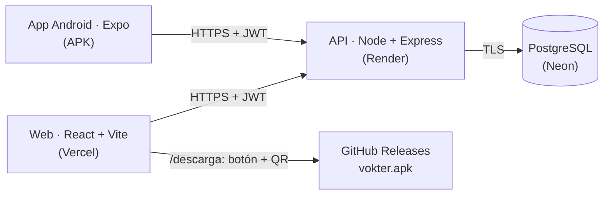
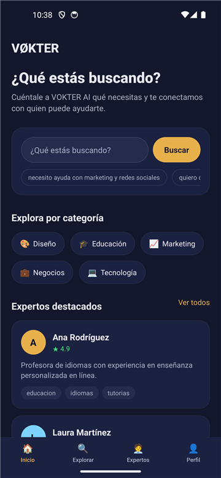
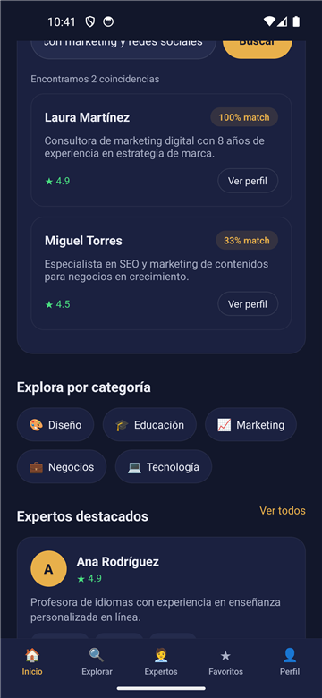
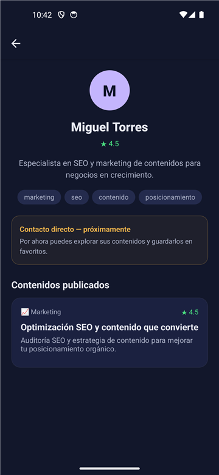
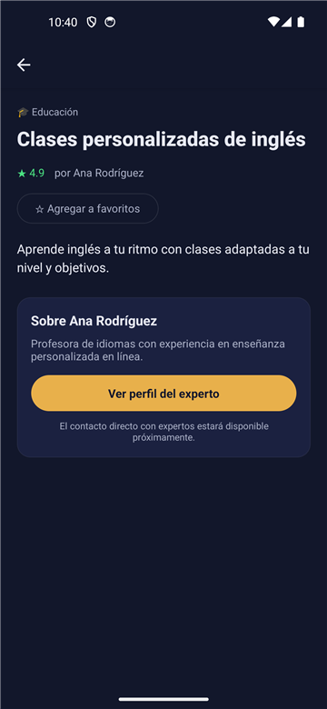
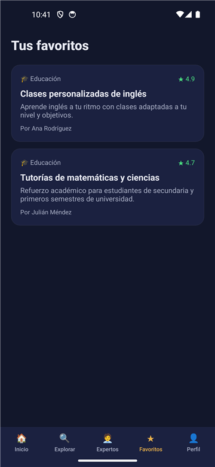
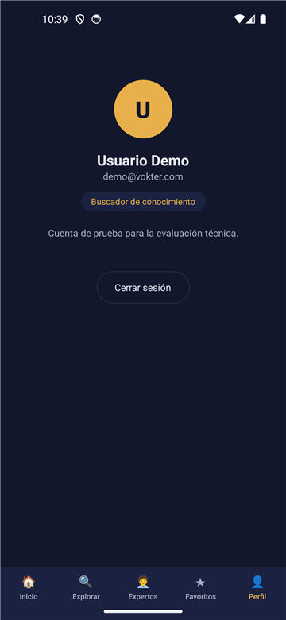
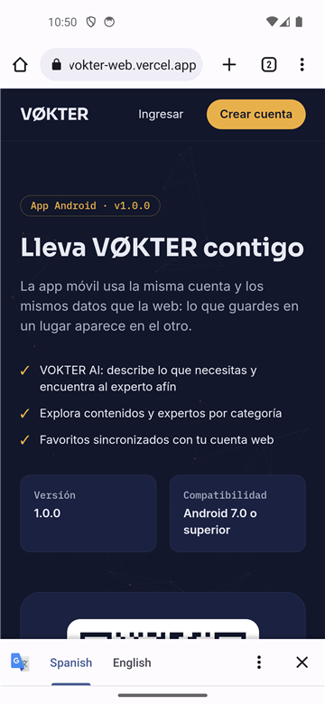
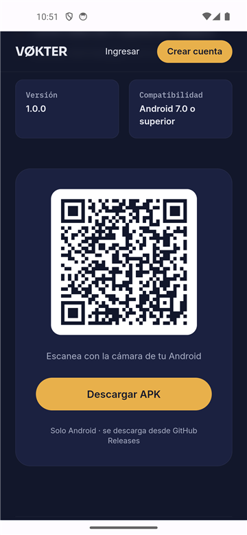

# VØKTER — Voice of Knowledge

Plataforma web + app Android que conecta a personas con **conocimiento, contenidos y expertos**.
Su núcleo es **VOKTER AI**: describes lo que necesitas en lenguaje natural y el sistema te sugiere
los expertos más afines con un porcentaje de coincidencia.

## URLs públicas

| Recurso | URL |
|---|---|
| **Web** (Vercel) | <https://vokter-web.vercel.app> |
| **Descarga de la app** (botón + QR) | <https://vokter-web.vercel.app/descarga> |
| **API** (Render) | <https://vokter-api-2571.onrender.com/api> · salud: [`/api/health`](https://vokter-api-2571.onrender.com/api/health) |
| **APK** (GitHub Release v1.0.0) | <https://github.com/Brayabn/vokter/releases/download/v1.0.0/VOKTER-Android-v1.0.0.apk> |
| Release | <https://github.com/Brayabn/vokter/releases/tag/v1.0.0> |
| Build EAS | <https://expo.dev/accounts/brayan.bello/projects/vokter-mobile/builds/0e14c037-f29a-4720-81ed-b8c174b9e60d> |

> La API usa el plan gratuito de Render: tras ~15 min sin tráfico la primera petición tarda 30-60 s.
> Antes de una demo, abre [`/api/health`](https://vokter-api-2571.onrender.com/api/health) para despertarla.

# Instalación rápida con Docker

La forma más sencilla de ejecutar VØKTER en tu equipo: web + API + PostgreSQL con un solo comando.

### Requisitos

- [Docker Desktop](https://www.docker.com/products/docker-desktop/) (en ejecución)
- Git

**No** hace falta instalar Node.js, npm ni PostgreSQL.

### Iniciar

```bash
git clone https://github.com/Brayabn/vokter.git
cd vokter
docker compose up --build
```

La primera vez tarda unos minutos (descarga imágenes e instala dependencias). Cuando los tres
servicios estén listos:

| Servicio | URL |
|---|---|
| **Web** | <http://localhost:8080> |
| **API** | <http://localhost:4100/api> (salud: <http://localhost:4100/api/health>) |

La base de datos se crea y se llena con datos demo automáticamente. Usa las
[credenciales demo](#credenciales-demo): `demo@vokter.com` / `vokter123`.

No hace falta crear ningún archivo `.env`: todos los valores tienen un default de desarrollo. Para
cambiar puertos o credenciales locales, copia [`.env.example`](.env.example) como `.env`.

### Comandos útiles

| Acción | Comando |
|---|---|
| Iniciar (con build) | `docker compose up --build` |
| Iniciar en segundo plano | `docker compose up -d --build` |
| Ver estado | `docker compose ps` |
| Ver logs | `docker compose logs -f` |
| Detener (conserva los datos) | `docker compose down` |
| Reiniciar | `docker compose restart` |
| Consola de PostgreSQL | `docker compose exec database psql -U vokter -d vokter` |
| **Eliminar los datos locales** | `docker compose down -v` ⚠️ borra el volumen de la base de datos |

### Cómo funciona

```
docker compose
├── frontend  nginx :8080 → sirve la web (build de Vite) y reenvía /api → backend
├── backend   Node + Express :4100 → espera a que PostgreSQL esté healthy, crea tablas y datos demo
└── database  PostgreSQL 16 → volumen postgres_data (los datos sobreviven a "down")
```

- La web se compila con `VITE_API_URL=/api` (mismo origen). El navegador llama a
  `http://localhost:8080/api/...` y **nginx** reenvía a `backend:4100` dentro de la red de Docker, así
  el navegador nunca necesita resolver el nombre interno `backend` y no hay problemas de CORS.
- La API también se publica en `localhost:4100` para pruebas directas y para la app móvil.
- Arranque en orden con healthchecks: `database` (`pg_isready`) → `backend` (`/api/health`, que
  también comprueba la BD) → `frontend`.
- PostgreSQL **no** se publica en el equipo (evita conflictos con un PostgreSQL local en 5432).
- Puertos elegidos para no chocar con servicios comunes (3000, 4000, 5432); se cambian con
  `WEB_PORT` y `API_PORT` en `.env`.

> **Si un puerto ya está en uso:** crea `.env` con, por ejemplo, `WEB_PORT=8081` o `API_PORT=4200`
> y vuelve a ejecutar `docker compose up -d`.

### App móvil con el backend de Docker

La app Android **no** corre en Docker (se compila con Expo/EAS). Para probarla contra el backend
local, en `mobile/.env` usa la IP de tu PC en la red: `EXPO_PUBLIC_API_URL=http://<IP-de-tu-PC>:4100/api`
y ejecuta `npx expo start`. El APK publicado usa siempre la API de producción.

### Local vs. producción

| Entorno | Web | API | Base de datos |
|---|---|---|---|
| **Local (Docker)** | nginx en `localhost:8080` | contenedor `backend` (`localhost:4100`) | PostgreSQL en contenedor (volumen `postgres_data`) |
| **Producción** | Vercel | Render | Neon (PostgreSQL gestionado) |
| **App móvil (APK)** | — | Render | Neon |

Docker es solo para instalación y demostración local; **no** reemplaza la infraestructura de
producción. Los Dockerfiles no se usan en Render (runtime Node nativo, `render.yaml`) ni en Vercel.

## Descripción

VØKTER toma como referencia la plataforma [VOKTER](https://vokter-five.vercel.app/) y la evoluciona
hacia un **marketplace de conocimiento**: en lugar de navegar un catálogo, el usuario cuenta su
necesidad y la plataforma lo conecta con quien puede resolverla.

## Problema

Encontrar a la persona correcta para un problema concreto (marketing, desarrollo, finanzas,
idiomas…) suele implicar búsquedas por palabras exactas y listas largas de resultados poco
relevantes, y la experiencia no continúa en el móvil.

## Propuesta

- **Búsqueda por intención** (VOKTER AI): la consulta en lenguaje natural se compara con las
  habilidades y la bio de cada experto y devuelve un *match score*.
- **Catálogo** de contenidos y expertos por categoría, con búsqueda y filtros.
- **Web y app Android sobre la misma API y la misma cuenta**: los favoritos se sincronizan.
- **Descarga directa** de la app desde la web mediante botón y **código QR**.

## Características

| | Web | App Android |
|---|---|---|
| Registro / login (JWT) | ✅ | ✅ (token en SecureStore) |
| VOKTER AI (match por lenguaje natural) | ✅ | ✅ |
| Explorar: búsqueda + categorías | ✅ | ✅ |
| Detalle de contenido | ✅ | ✅ |
| Perfil de experto | ✅ | ✅ |
| Favoritos sincronizados | ✅ | ✅ |
| Sesión resistente a errores de red | ✅ | ✅ |
| Estados de carga / error / vacío | ✅ | ✅ |
| Descarga del APK con botón + QR | ✅ (`/descarga`) | — |

## Arquitectura



Detalle, modelo de datos y decisiones: [`docs/architecture.md`](docs/architecture.md) ·
flujos (auth, web, móvil, descarga): [`docs/flows.md`](docs/flows.md).

## Tecnologías

- **Backend:** Node.js 20, Express 4, Sequelize 6, PostgreSQL (producción) / SQLite (local), JWT, bcrypt, helmet, express-rate-limit.
- **Web:** React 18, Vite 5, Tailwind CSS 3, React Router 6, axios, qrcode.react, anime.js.
- **Móvil:** Expo SDK 57, React Native 0.86, React Navigation 7, expo-secure-store, axios.
- **Infraestructura:** Render (API), Neon (PostgreSQL), Vercel (web), EAS Build (APK), GitHub Releases (descarga).
- **Local:** Docker Compose (nginx + Node + PostgreSQL 16).

## Estructura del proyecto

```
.
├── backend/           API REST (Express + Sequelize) · Dockerfile
│   ├── src/           config · models · controllers · routes · middleware · utils
│   └── scripts/       smoke-test.js (verificación de la API en cualquier entorno)
├── frontend/          Web (React + Vite) · vercel.json · Dockerfile + nginx.conf
├── mobile/            App Android (Expo) · app.json · eas.json
├── database/          schema.sql (esquema PostgreSQL de referencia)
├── docs/              arquitectura, flujos, API, despliegue y capturas
├── builds/            APKs locales (ignorados por git; se publican en Releases)
├── render.yaml        Blueprint de Render (API de producción como código)
├── docker-compose.yml instalación local: web + API + PostgreSQL
└── .env.example       variables opcionales de docker compose
```

## Requisitos

- **Con Docker** (recomendado para evaluar): Docker Desktop y Git. Ver [Instalación rápida con Docker](#instalación-rápida-con-docker).
- **Sin Docker** (desarrollo): Node.js ≥ 20 y npm. Sin base de datos que instalar: se usa SQLite.
- Para probar la app en un teléfono: [Expo Go](https://expo.dev/go) (SDK 57) en la misma red Wi-Fi que el PC, o el APK.

## Instalación local sin Docker (desarrollo)

```bash
git clone https://github.com/Brayabn/vokter.git
cd vokter
```

### Backend

```bash
cd backend
cp .env.example .env       # en Windows: copy .env.example .env
npm install
npm run dev                # http://localhost:4000 — crea las tablas y los datos demo al arrancar
```

> Si el puerto 4000 está ocupado, cambia `PORT` en `backend/.env` (y la URL en la web/móvil).

### Frontend

```bash
cd frontend
cp .env.example .env
npm install
npm run dev                # http://localhost:5173
```

### Mobile

```bash
cd mobile
cp .env.example .env       # EXPO_PUBLIC_API_URL=http://<IP-de-tu-PC>:4000/api
npm install
npx expo start             # escanea el QR de la terminal con Expo Go
```

En un teléfono, `localhost` es el propio teléfono: usa la IP de tu PC en la red (`ipconfig` →
"Dirección IPv4"). Si cambias `.env`, reinicia con `npx expo start -c`.

## Variables de entorno

| Variable | Dónde | Descripción |
|---|---|---|
| `NODE_ENV` | backend | `production` activa la validación estricta |
| `PORT` | backend | Puerto HTTP (Render lo asigna) |
| `DATABASE_URL` | backend | PostgreSQL (Neon). Vacía → SQLite local |
| `DB_STORAGE` | backend | Ruta del archivo SQLite (solo local) |
| `JWT_SECRET` | backend | Secreto de los JWT (≥ 32 caracteres en producción) |
| `JWT_EXPIRES_IN` | backend | Vigencia del token (`7d`) |
| `CORS_ORIGIN` | backend | Dominios de la web permitidos, separados por coma |
| `SEED_DEMO_DATA` | backend | `true` = crea los datos demo que falten al arrancar |
| `VITE_API_URL` | web | URL del API (termina en `/api`) |
| `VITE_APK_URL` | web | URL pública (HTTPS) del APK: la usan el botón y el QR |
| `VITE_APK_VERSION` | web | Versión mostrada en `/descarga` |
| `EXPO_PUBLIC_API_URL` | móvil | URL del API (`.env` en local; `eas.json` para el APK) |

Plantillas: `backend/.env.example`, `frontend/.env.example`, `mobile/.env.example`. Ningún `.env` se versiona.

## Base de datos

- **Producción:** PostgreSQL en Neon, conexión TLS vía `DATABASE_URL`.
- **Local:** SQLite (`backend/data/vokter.sqlite`), sin configuración.
- **Esquema:** lo crea `sequelize.sync()` al arrancar (crea tablas faltantes; no altera ni borra). Referencia: [`database/schema.sql`](database/schema.sql).
- **Datos demo:** `npm run seed` (idempotente: no duplica) · `npm run seed:reset` (borra y recrea; bloqueado en producción).

## Deploy

Guía paso a paso: [`docs/deploy.md`](docs/deploy.md). Resumen:

1. **Neon:** crear la base y copiar la connection string.
2. **Render:** *New → Blueprint* con [`render.yaml`](render.yaml); definir `DATABASE_URL` (y luego `CORS_ORIGIN`).
3. **EAS:** `eas build --profile preview` con `EXPO_PUBLIC_API_URL` = API de Render (HTTPS).
4. **GitHub Release:** publicar `vokter.apk`.
5. **Vercel:** raíz `frontend/`, variables `VITE_API_URL`, `VITE_APK_URL`, `VITE_APK_VERSION`.

## APK

- Package `com.vokter.app` · versión `1.0.0` · versionCode `1` · Android 7.0+ (minSdk 24, targetSdk 36).
- Generado con EAS Build, perfil `preview` (`buildType: apk`), firmado con el keystore gestionado por EAS.
- Archivo: `VOKTER-Android-v1.0.0.apk` · 77.437.218 bytes (73,9 MB) ·
  SHA-256 `b75591429102924bd34beeee36d4c6b2526cf392d08bf8395fea80772eb2df60`.
- La URL del API se incrusta al compilar desde `eas.json` (`EXPO_PUBLIC_API_URL`). Verificación del
  bundle embebido (`assets/index.android.bundle`): contiene `https://vokter-api-2571.onrender.com/api`,
  **ninguna IP privada** (192.168.x, 172.16-31.x, 10.x) ni URLs de túnel. La única cadena `localhost`
  es un valor interno de axios (`window.location.href || 'http://localhost'`), no configuración del proyecto.

## Descarga mediante QR

La página **[`/descarga`](https://vokter-web.vercel.app/descarga)** muestra la versión, la compatibilidad,
los pasos de instalación, el botón **Descargar APK** y un **código QR**. Ambos usan exactamente la misma
URL (`VITE_APK_URL`):

`https://github.com/Brayabn/vokter/releases/download/v1.0.0/VOKTER-Android-v1.0.0.apk`

Flujo verificado: web → QR/botón → GitHub Release → descarga del APK → instalación (orígenes
desconocidos) → app → API HTTPS de Render → PostgreSQL de Neon.

## Credenciales demo

| Usuario | Contraseña | Rol |
|---|---|---|
| `demo@vokter.com` | `vokter123` | Usuario |
| `laura@vokter.com` (y otros 9 expertos `@vokter.com`) | `vokter123` | Experto |

Son datos ficticios del seed. También puedes registrarte con una cuenta nueva.

## Endpoints principales

| Método | Ruta | Descripción |
|---|---|---|
| GET | `/api/health` | Estado del servicio y de la BD |
| POST | `/api/auth/register` · `/api/auth/login` | Registro / login → JWT |
| GET | `/api/auth/me` | Usuario autenticado |
| GET | `/api/categories` | Categorías |
| GET | `/api/contents?search=&categorySlug=&sort=rating` | Buscar y filtrar |
| GET | `/api/contents/:id` | Detalle |
| GET | `/api/experts` · `/api/experts/:id` | Expertos · perfil + contenidos |
| GET/POST/DELETE | `/api/favorites[/:contentId]` | Favoritos (con token) |
| POST | `/api/ai/match` | VOKTER AI |

Referencia completa: [`docs/api.md`](docs/api.md). Verificación automática:
`cd backend && npm run smoke -- <URL-del-API>` (19 comprobaciones).

## Decisiones técnicas

- **Expo + EAS** en lugar de React Native CLI: el código ya usaba módulos de Expo y EAS compila el APK en la nube, sin Android SDK/Gradle local.
- **PostgreSQL en producción, SQLite en local** con los mismos modelos de Sequelize: persistencia real sin complicar el desarrollo.
- **Seed idempotente + `sync()`** en lugar de migraciones: suficiente para un esquema pequeño y estable; seguro de ejecutar en cada arranque.
- **Configuración validada al arrancar** (fail-fast): en producción el API no inicia sin `JWT_SECRET` fuerte y `DATABASE_URL`.
- **APK en GitHub Releases**: URL pública y versionada, sin binarios en el repositorio.
- **VOKTER AI por reglas**: transparente y sin costos; aislado en `matchEngine.js` para reemplazarlo por un LLM.

Más detalle y alternativas descartadas: [`docs/architecture.md`](docs/architecture.md#decisiones-técnicas).

## Consideraciones de seguridad

- bcrypt para contraseñas; JWT firmado con un secreto que genera Render (nunca en el repositorio).
- CORS por lista blanca; `helmet`; rate limit en login/registro; límite de tamaño del body.
- TLS hacia Neon; errores sin stack traces hacia el cliente.
- Token móvil en SecureStore (Keystore de Android).
- `.env`, bases SQLite, keystores y APKs excluidos por `.gitignore`.

## Limitaciones conocidas

- **Arranque en frío** (plan gratuito de Render): la primera petición tras ~15 min sin uso tarda 30-60 s. Conviene abrir `/api/health` antes de una demo.
- El **contacto directo** con expertos está marcado como "próximamente" (no existe en el backend).
- **APK fuera de Play Store**: Chrome advierte "File might be harmful" al descargar un APK, Android pide permitir "orígenes desconocidos" y Play Protect puede advertir. Es el comportamiento estándar para apps fuera de la tienda.
- Tras crear una cuenta en la app, el teclado puede quedar visible hasta tocar fuera (detalle menor de UX pendiente).
- Solo **Android** (no hay build de iOS).
- VOKTER AI compara palabras clave y raíces; no entiende sinónimos como lo haría un LLM.
- Sin migraciones formales: cambios de esquema futuros deberían introducirlas.

## Evidencia de funcionamiento

**Entorno público (verificado):**

- API en Render sobre Neon: `npm run smoke -- https://vokter-api-2571.onrender.com/api` → **19/19**; `/api/health` → `{"status":"ok","database":"postgres"}`; CORS acepta `https://vokter-web.vercel.app` y rechaza otros orígenes.
- Web en Vercel: todas las rutas (`/`, `/login`, `/registro`, `/explorar`, `/descarga`, `/dashboard`, `/favoritos`, `/experto/:id`, `/contenido/:id`) responden 200; el build incluye la API de Render y la URL real del APK; flujo de registro, login, búsqueda, favoritos y VOKTER AI verificado con el origen real de la web.
- APK instalado en Android 14: splash, login, registro, explorar, detalle, favoritos (guardados en Neon), VOKTER AI, perfil de experto y logout contra la API pública.
- `/descarga` abierta en Chrome de Android: el QR decodificado desde la pantalla contiene exactamente la URL del asset; el botón descargó el APK (SHA-256 idéntico) y se instaló con el instalador del sistema.
- Persistencia: un usuario creado en producción sigue disponible tras el paso del tiempo (datos en Neon, no en el contenedor).

**Local:** verificado contra PostgreSQL 16 (modo producción) y SQLite: esquema, restricciones, seed idempotente, persistencia tras reinicio y CORS.

**Docker:** `docker compose build` + `up -d` → los tres servicios `healthy` en orden; smoke test 19/19 tanto directo (`localhost:4100/api`) como a través de nginx (`localhost:8080/api`); todas las rutas de la web responden; los datos (incluidos usuarios registrados) sobreviven a `docker compose restart` y a `down` + `up`, y el seed no duplica registros. Las imágenes no contienen `.env`, tokens ni SQLite, y el backend corre sin privilegios de root.

### Capturas

| Splash | Inicio | VOKTER AI | Perfil de experto | Detalle |
|---|---|---|---|---|
|  |  |  |  |  |

| Favoritos | Perfil | Web `/descarga` | Web `/descarga` (QR) |
|---|---|---|---|
|  |  |  |  |
