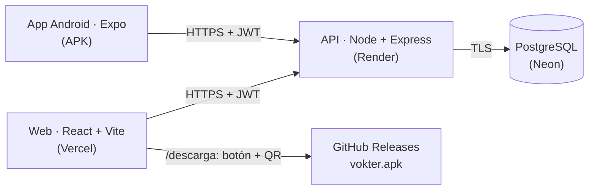

# VØKTER — Voice of Knowledge

Plataforma web + app Android que conecta a personas con **conocimiento, contenidos y expertos**.
Su núcleo es **VOKTER AI**: describes lo que necesitas en lenguaje natural y el sistema te sugiere
los expertos más afines con un porcentaje de coincidencia.

## URLs públicas

| Recurso | URL |
|---|---|
| Web | _pendiente de despliegue (Vercel)_ |
| API | _pendiente de despliegue (Render)_ |
| Descarga del APK | _pendiente (GitHub Release)_ — también desde la web en `/descarga` (botón + QR) |

> Estas URLs se completan solo cuando el servicio está desplegado y verificado.

## Descripción

VØKTER toma como referencia la plataforma [VOKTER](https://vokter-five.vercel.app/) y la evoluciona
hacia un **marketplace de conocimiento**: en lugar de navegar un catálogo, el usuario cuenta su
necesidad y la plataforma lo conecta con quien puede resolverla.

## Problema

Encontrar a la persona correcta para un problema concreto (marketing, desarrollo, finanzas,
idiomas…) suele implicar búsquedas por palabras exactas y listas largas de resultados poco
relevantes, y la experiencia no continúa en el móvil.

## Propuesta

- **Búsqueda por intención** (VOKTER AI): la consulta en lenguaje natural se compara con las
  habilidades y la bio de cada experto y devuelve un *match score*.
- **Catálogo** de contenidos y expertos por categoría, con búsqueda y filtros.
- **Web y app Android sobre la misma API y la misma cuenta**: los favoritos se sincronizan.
- **Descarga directa** de la app desde la web mediante botón y **código QR**.

## Características

| | Web | App Android |
|---|---|---|
| Registro / login (JWT) | ✅ | ✅ (token en SecureStore) |
| VOKTER AI (match por lenguaje natural) | ✅ | ✅ |
| Explorar: búsqueda + categorías | ✅ | ✅ |
| Detalle de contenido | ✅ | ✅ |
| Perfil de experto | ✅ | ✅ |
| Favoritos sincronizados | ✅ | ✅ |
| Sesión resistente a errores de red | ✅ | ✅ |
| Estados de carga / error / vacío | ✅ | ✅ |
| Descarga del APK con botón + QR | ✅ (`/descarga`) | — |

## Arquitectura



Detalle, modelo de datos y decisiones: [`docs/architecture.md`](docs/architecture.md) ·
flujos (auth, web, móvil, descarga): [`docs/flows.md`](docs/flows.md).

## Tecnologías

- **Backend:** Node.js 20, Express 4, Sequelize 6, PostgreSQL (producción) / SQLite (local), JWT, bcrypt, helmet, express-rate-limit.
- **Web:** React 18, Vite 5, Tailwind CSS 3, React Router 6, axios, qrcode.react, anime.js.
- **Móvil:** Expo SDK 57, React Native 0.86, React Navigation 7, expo-secure-store, axios.
- **Infraestructura:** Render (API), Neon (PostgreSQL), Vercel (web), EAS Build (APK), GitHub Releases (descarga).

## Estructura del proyecto

```
.
├── backend/           API REST (Express + Sequelize)
│   ├── src/           config · models · controllers · routes · middleware · utils
│   └── scripts/       smoke-test.js (verificación de la API en cualquier entorno)
├── frontend/          Web (React + Vite) · vercel.json
├── mobile/            App Android (Expo) · app.json · eas.json
├── database/          schema.sql (esquema PostgreSQL de referencia)
├── docs/              arquitectura, flujos, API y despliegue
├── builds/            APKs locales (ignorados por git; se publican en Releases)
├── render.yaml        Blueprint de Render (API como código)
└── docker-compose.yml backend + web en contenedores (desarrollo)
```

## Requisitos

- Node.js ≥ 20 y npm.
- Para probar la app en un teléfono: [Expo Go](https://expo.dev/go) (SDK 57) en la misma red Wi-Fi que el PC, o el APK.
- Sin base de datos que instalar en local: se usa SQLite.

## Instalación local

```bash
git clone <este-repositorio>
cd <repositorio>
```

### Backend

```bash
cd backend
cp .env.example .env       # en Windows: copy .env.example .env
npm install
npm run dev                # http://localhost:4000 — crea las tablas y los datos demo al arrancar
```

> Si el puerto 4000 está ocupado, cambia `PORT` en `backend/.env` (y la URL en la web/móvil).

### Frontend

```bash
cd frontend
cp .env.example .env
npm install
npm run dev                # http://localhost:5173
```

### Mobile

```bash
cd mobile
cp .env.example .env       # EXPO_PUBLIC_API_URL=http://<IP-de-tu-PC>:4000/api
npm install
npx expo start             # escanea el QR de la terminal con Expo Go
```

En un teléfono, `localhost` es el propio teléfono: usa la IP de tu PC en la red (`ipconfig` →
"Dirección IPv4"). Si cambias `.env`, reinicia con `npx expo start -c`.

## Variables de entorno

| Variable | Dónde | Descripción |
|---|---|---|
| `NODE_ENV` | backend | `production` activa la validación estricta |
| `PORT` | backend | Puerto HTTP (Render lo asigna) |
| `DATABASE_URL` | backend | PostgreSQL (Neon). Vacía → SQLite local |
| `DB_STORAGE` | backend | Ruta del archivo SQLite (solo local) |
| `JWT_SECRET` | backend | Secreto de los JWT (≥ 32 caracteres en producción) |
| `JWT_EXPIRES_IN` | backend | Vigencia del token (`7d`) |
| `CORS_ORIGIN` | backend | Dominios de la web permitidos, separados por coma |
| `SEED_DEMO_DATA` | backend | `true` = crea los datos demo que falten al arrancar |
| `VITE_API_URL` | web | URL del API (termina en `/api`) |
| `VITE_APK_URL` | web | URL pública (HTTPS) del APK: la usan el botón y el QR |
| `VITE_APK_VERSION` | web | Versión mostrada en `/descarga` |
| `EXPO_PUBLIC_API_URL` | móvil | URL del API (`.env` en local; `eas.json` para el APK) |

Plantillas: `backend/.env.example`, `frontend/.env.example`, `mobile/.env.example`. Ningún `.env` se versiona.

## Base de datos

- **Producción:** PostgreSQL en Neon, conexión TLS vía `DATABASE_URL`.
- **Local:** SQLite (`backend/data/vokter.sqlite`), sin configuración.
- **Esquema:** lo crea `sequelize.sync()` al arrancar (crea tablas faltantes; no altera ni borra). Referencia: [`database/schema.sql`](database/schema.sql).
- **Datos demo:** `npm run seed` (idempotente: no duplica) · `npm run seed:reset` (borra y recrea; bloqueado en producción).

## Deploy

Guía paso a paso: [`docs/deploy.md`](docs/deploy.md). Resumen:

1. **Neon:** crear la base y copiar la connection string.
2. **Render:** *New → Blueprint* con [`render.yaml`](render.yaml); definir `DATABASE_URL` (y luego `CORS_ORIGIN`).
3. **EAS:** `eas build --profile preview` con `EXPO_PUBLIC_API_URL` = API de Render (HTTPS).
4. **GitHub Release:** publicar `vokter.apk`.
5. **Vercel:** raíz `frontend/`, variables `VITE_API_URL`, `VITE_APK_URL`, `VITE_APK_VERSION`.

## APK

- Package `com.vokter.app` · versión `1.0.0` · versionCode `1` · Android 7.0+ (minSdk 24, targetSdk 36).
- Generado con EAS Build, perfil `preview` (`buildType: apk`).
- La URL del API se incrusta al compilar desde `eas.json`; antes de publicar se verifica que el bundle
  contenga la URL HTTPS del API y **ninguna** referencia a `localhost` o IPs privadas.

## Descarga mediante QR

La página **`/descarga`** muestra la versión, la compatibilidad, los pasos de instalación, el botón
**Descargar APK** y un **código QR**. Ambos usan exactamente la misma URL (`VITE_APK_URL`), que apunta
al asset del GitHub Release. Escanear el QR con la cámara de un Android abre la descarga directa.

## Credenciales demo

| Usuario | Contraseña | Rol |
|---|---|---|
| `demo@vokter.com` | `vokter123` | Usuario |
| `laura@vokter.com` (y otros 9 expertos `@vokter.com`) | `vokter123` | Experto |

Son datos ficticios del seed. También puedes registrarte con una cuenta nueva.

## Endpoints principales

| Método | Ruta | Descripción |
|---|---|---|
| GET | `/api/health` | Estado del servicio y de la BD |
| POST | `/api/auth/register` · `/api/auth/login` | Registro / login → JWT |
| GET | `/api/auth/me` | Usuario autenticado |
| GET | `/api/categories` | Categorías |
| GET | `/api/contents?search=&categorySlug=&sort=rating` | Buscar y filtrar |
| GET | `/api/contents/:id` | Detalle |
| GET | `/api/experts` · `/api/experts/:id` | Expertos · perfil + contenidos |
| GET/POST/DELETE | `/api/favorites[/:contentId]` | Favoritos (con token) |
| POST | `/api/ai/match` | VOKTER AI |

Referencia completa: [`docs/api.md`](docs/api.md). Verificación automática:
`cd backend && npm run smoke -- <URL-del-API>` (19 comprobaciones).

## Decisiones técnicas

- **Expo + EAS** en lugar de React Native CLI: el código ya usaba módulos de Expo y EAS compila el APK en la nube, sin Android SDK/Gradle local.
- **PostgreSQL en producción, SQLite en local** con los mismos modelos de Sequelize: persistencia real sin complicar el desarrollo.
- **Seed idempotente + `sync()`** en lugar de migraciones: suficiente para un esquema pequeño y estable; seguro de ejecutar en cada arranque.
- **Configuración validada al arrancar** (fail-fast): en producción el API no inicia sin `JWT_SECRET` fuerte y `DATABASE_URL`.
- **APK en GitHub Releases**: URL pública y versionada, sin binarios en el repositorio.
- **VOKTER AI por reglas**: transparente y sin costos; aislado en `matchEngine.js` para reemplazarlo por un LLM.

Más detalle y alternativas descartadas: [`docs/architecture.md`](docs/architecture.md#decisiones-técnicas).

## Consideraciones de seguridad

- bcrypt para contraseñas; JWT firmado con un secreto que genera Render (nunca en el repositorio).
- CORS por lista blanca; `helmet`; rate limit en login/registro; límite de tamaño del body.
- TLS hacia Neon; errores sin stack traces hacia el cliente.
- Token móvil en SecureStore (Keystore de Android).
- `.env`, bases SQLite, keystores y APKs excluidos por `.gitignore`.

## Limitaciones conocidas

- **Arranque en frío** (plan gratuito de Render): la primera petición tras ~15 min sin uso tarda 30-60 s. Conviene abrir `/api/health` antes de una demo.
- El **contacto directo** con expertos está marcado como "próximamente" (no existe en el backend).
- **APK fuera de Play Store**: Android pide permitir "orígenes desconocidos" y Play Protect puede advertir.
- Solo **Android** (no hay build de iOS).
- VOKTER AI compara palabras clave y raíces; no entiende sinónimos como lo haría un LLM.
- Sin migraciones formales: cambios de esquema futuros deberían introducirlas.

## Evidencia de funcionamiento

- Prueba de humo de la API (19 comprobaciones): `npm run smoke -- <URL>`.
- Verificado en local contra **PostgreSQL 16** (modo producción) y **SQLite**: esquema, restricciones, seed idempotente, persistencia tras reinicio y CORS.
- App probada en Android 14 (emulador) con Expo Go: login, registro, favoritos, VOKTER AI, sesión sin red, logout.
- _Capturas y verificación del entorno público: se agregan tras el despliegue._
