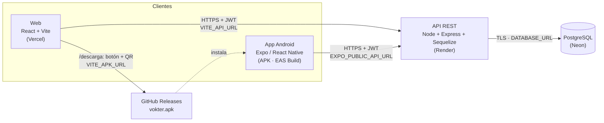
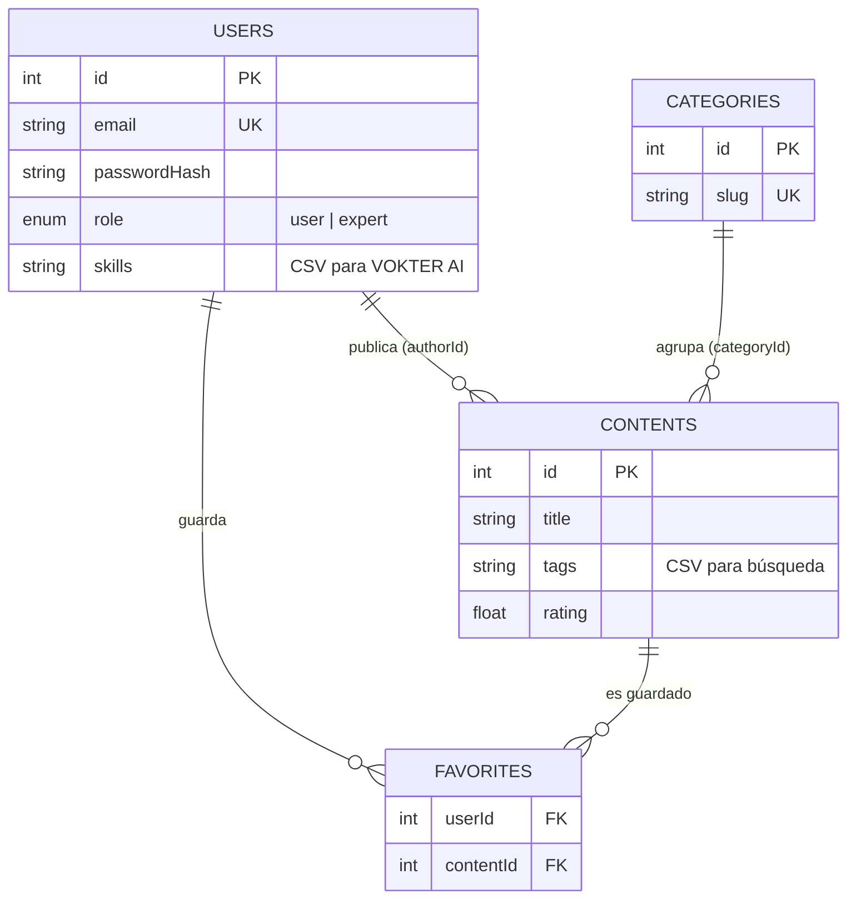

# Arquitectura de VØKTER

## Visión general

Tres clientes de una misma API REST: la web, la app Android y (para la descarga) GitHub Releases.
Web y móvil comparten **backend, base de datos y cuentas**: un favorito guardado en el teléfono aparece en la web.



| Capa | Tecnología | Dónde corre | Configuración |
|---|---|---|---|
| Web | React 18, Vite 5, Tailwind, react-router | Vercel (estático + rewrites SPA) | `VITE_API_URL`, `VITE_APK_URL`, `VITE_APK_VERSION` |
| Móvil | Expo SDK 57, React Native 0.86, React Navigation 7 | Teléfono Android (APK) | `EXPO_PUBLIC_API_URL` (fijada por perfil en `eas.json`) |
| API | Node 20, Express 4, Sequelize 6, JWT, bcrypt | Render (web service) | `DATABASE_URL`, `JWT_SECRET`, `CORS_ORIGIN`, `NODE_ENV` |
| Datos | PostgreSQL | Neon (serverless) | `DATABASE_URL` con TLS |
| Desarrollo | SQLite | archivo local | sin `DATABASE_URL` |
| Local con Docker | nginx + Node + PostgreSQL 16 | `docker compose` | defaults en `docker-compose.yml` (opcional `.env`) |

### Entornos

```
LOCAL (docker compose)                 PRODUCCIÓN                      MÓVIL
nginx :3000 ──/api──▶ backend :4100    Vercel ──HTTPS──▶ Render         APK ──HTTPS──▶ Render
                         │                                  │                             │
                  PostgreSQL (volumen)                    Neon                          Neon
```

Docker solo facilita la instalación y demostración local; no reemplaza ni modifica la
infraestructura de producción.

## Estructura del backend

```
backend/src/
├── config/     env.js (lee y valida variables) · db.js (PostgreSQL o SQLite)
├── models/     User, Category, Content, Favorite + relaciones
├── middleware/ auth.js (requireAuth, requireRole)
├── controllers/ auth, content (contenidos, categorías, expertos), favorite, ai
├── routes/     un router por recurso, montados en /api/*
├── utils/      matchEngine (VOKTER AI), seed + seedData, params
└── server.js   middlewares globales, health check, arranque
```

Patrón en capas simple (rutas → controladores → modelos): suficiente para el tamaño del dominio y fácil
de recorrer en una entrevista. No se añadieron servicios/repositorios para no sobre-ingenierizar.

## Modelo de datos



`favorites` tiene restricción única `(userId, contentId)` y borrado en cascada. El DDL exacto está en
[`database/schema.sql`](../database/schema.sql).

## Decisiones técnicas

| Decisión | Por qué | Alternativa descartada |
|---|---|---|
| **Monorepo** (`backend/`, `frontend/`, `mobile/`) | Una sola fuente de verdad; la integración web ↔ móvil ↔ API se revisa en un mismo lugar | Repos separados: más coordinación sin beneficio a este tamaño |
| **Sequelize con PostgreSQL en producción y SQLite en local** | Local sin instalar nada; producción persistente. Los modelos son los mismos | Solo SQLite en producción: el disco de Render gratuito se borra al reiniciar |
| **Neon** (PostgreSQL serverless) | Gratuito, persistente, TLS, conexión por URL | Base de Render: el plan gratuito caduca |
| **Render** para la API | Despliegue desde Git, HTTPS automático, health checks, Blueprint (`render.yaml`) como código | Railway/Fly.io: sin plan gratuito o requieren tarjeta |
| **Vercel** para la web | Build de Vite nativo, CDN, HTTPS | Servir la web desde Express: acopla despliegues |
| **Expo + EAS Build** | El código ya usaba módulos de Expo; EAS compila el APK en la nube sin Android SDK/Gradle local | React Native CLI: reescribir módulos y mantener Android nativo a mano |
| **APK en GitHub Releases** | URL pública, estable y versionada; el binario no se mezcla con el código | APK dentro del repo: infla el historial |
| **`sync()` + seed idempotente** en lugar de migraciones | El esquema es pequeño y estable; el seed usa `findOrCreate` y puede correr en cada arranque sin duplicar | Migraciones formales (umzug/sequelize-cli): recomendadas si el esquema empieza a evolucionar |
| **JWT sin estado** + bcrypt | Estándar, escala sin sesiones en servidor, igual para web y móvil | Sesiones con cookie: complica el uso desde la app móvil |
| **VOKTER AI por reglas** (`utils/matchEngine.js`) | Transparente, sin costos ni API keys, explicable; aislado para cambiarlo por un LLM sin tocar el resto | LLM externo: costo, latencia y dependencia de un proveedor |
| **Token en SecureStore** (móvil) | Cifrado por el Keystore de Android | AsyncStorage: texto plano |

## Seguridad

- Contraseñas con bcrypt (10 rondas); nunca se devuelven en respuestas.
- `JWT_SECRET` obligatorio en producción (≥ 32 caracteres): el servidor **no arranca** sin él. En Render lo genera la plataforma (`generateValue`), nunca pasa por el repositorio.
- CORS por lista blanca (`CORS_ORIGIN`). Si está vacía en producción se rechazan todos los navegadores (seguro por defecto); la app nativa no usa CORS.
- `helmet`, límite de 100 kB en el body, rate limit en login/registro, `trust proxy` para ver la IP real detrás de Render.
- Autorización por rol (`requireRole('expert')`) para crear contenidos.
- Conexión a Neon con TLS verificado.
- Errores centralizados: el cliente nunca recibe stack traces.
- `.env`, SQLite local, keystores y APKs están en `.gitignore`.

## Resiliencia en los clientes

- La sesión solo se cierra ante `401` (token inválido/expirado) o `404` en `/auth/me`. Un error de red o timeout **no** cierra la sesión: el usuario se restaura desde caché (SecureStore / localStorage) y se revalida en segundo plano.
- Estados explícitos de carga, error con "Reintentar" y vacío en todas las pantallas (sin spinners infinitos ni errores silenciados).
- Timeout de 60 s para tolerar el arranque en frío del plan gratuito de Render.
- Búsqueda con debounce de 400 ms y descarte de respuestas fuera de orden.
