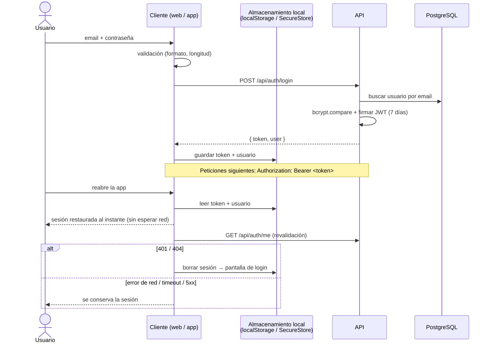
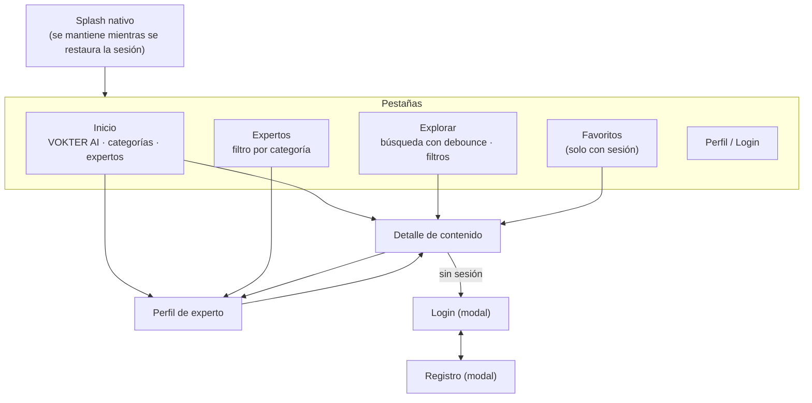
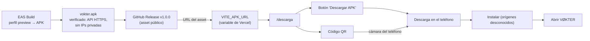

# Flujos de VØKTER

## 1. Autenticación (web y móvil)

## 2. Web

| Ruta | Acceso | Endpoints |
|---|---|---|
| `/` | Público | `POST /ai/match` (VOKTER AI en el hero) |
| `/registro`, `/login` | Público | `POST /auth/register`, `POST /auth/login` |
| `/explorar` | Público | `GET /categories`, `GET /contents?search=&categorySlug=` |
| `/contenido/:id` | Público (favoritos con sesión) | `GET /contents/:id`, `GET/POST/DELETE /favorites` |
| `/experto/:id` | Público | `GET /experts/:id` |
| `/dashboard` | Con sesión | `GET /contents?sort=rating`, `POST /ai/match` |
| `/favoritos` | Con sesión | `GET /favorites` |
| `/descarga` | Público | — (usa `VITE_APK_URL`) |

## 3. App móvil

Mismos endpoints que la web. La URL del API se fija al compilar con `EXPO_PUBLIC_API_URL`
(perfil `preview` de `mobile/eas.json` → API pública HTTPS).

## 4. Integración web ↔ API ↔ móvil

- Un único backend y una única base de datos: las cuentas, los favoritos y el catálogo son compartidos.
- Contrato común: JSON, JWT en `Authorization`, errores `{ error }`. Ambos clientes interpretan los errores con la misma lógica (`api/errors.js`) y aplican el mismo criterio de cierre de sesión (solo `401`).
- CORS aplica solo a la web (dominio de Vercel en `CORS_ORIGIN`); la app nativa no envía `Origin`.

## 5. Descarga del APK

El botón y el QR leen **la misma constante** (`APK_URL` en `frontend/src/config/app.js`). Si la
variable falta o no es HTTPS, la página muestra "Descarga no disponible" en lugar de un QR falso.
